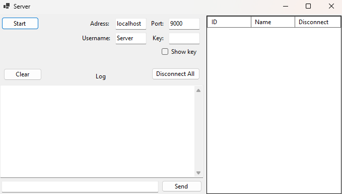
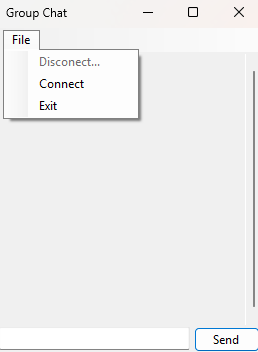
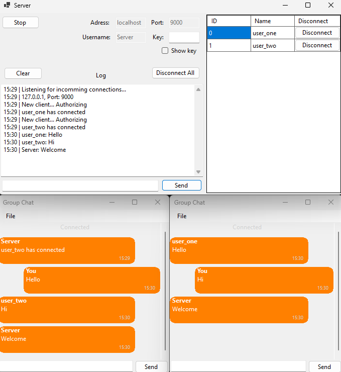

# 💬 WinForms Chat App

A **C# / WinForms** project that implements a simple client–server chat system. The solution contains two applications: a **Server** and a **Group Chat**.

## 🎓 Academic Context

Project created as part of the academic course **Programming in Graphical Environment** during the **2023/2024 summer semester** at **Warsaw University of Technology**.

## ✨ Features

### 🖥️ Chat Server

* ▶️ **Start** – launch the server and begin listening for incoming connections.
* 🧹 **Clear** – clear the server log.
* 📢 **Send** – broadcast a message to all connected clients.
* 🔌 **Disconnect all** – disconnect every client at once.
* ❌ **Disconnect (per user)** – disconnect a specific client from the chat.
* 📝 **Event logging** – all events (connections, disconnections, messages) are logged with timestamps.

### 💻 Chat Client

* 🔑 **Connection settings** – connect by providing **address**, **port**, **username**, and **key**.
* 🔄 **Connect** – establish connection to the server (with loading bar animation while connecting).
* 🔌 **Disconnect** – leave the server.
* ❌ **Exit** – close the application.

## 🎮 Workflow

1. Start the **Chat Server** and press **Start**.
2. Open the **Chat Client**, fill in connection settings, and click **Connect**.
3. Exchange messages – all activity is logged on the server with timestamps.
4. Server can broadcast messages, disconnect users individually, or disconnect everyone.

## 🛠️ Technologies

* **C# / WinForms**
* **Client–server architecture**
* **Socket communication**
* **Logging with timestamps**

## 🖼️ Preview

## 👤 Author

Developed by [Piotr Iśtok](https://github.com/p10tr13).

## 📜 License

This project is released under the MIT License.
